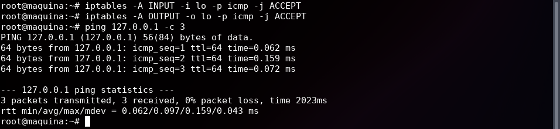
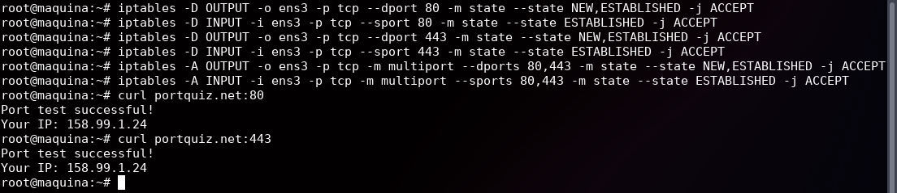
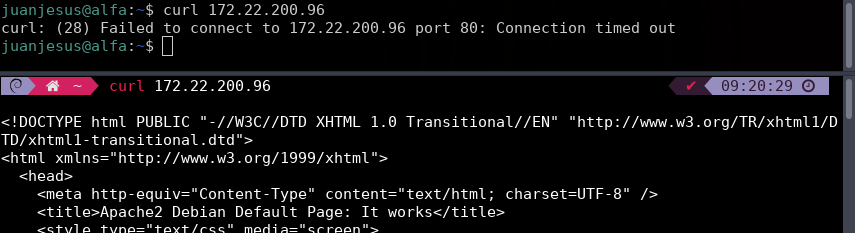
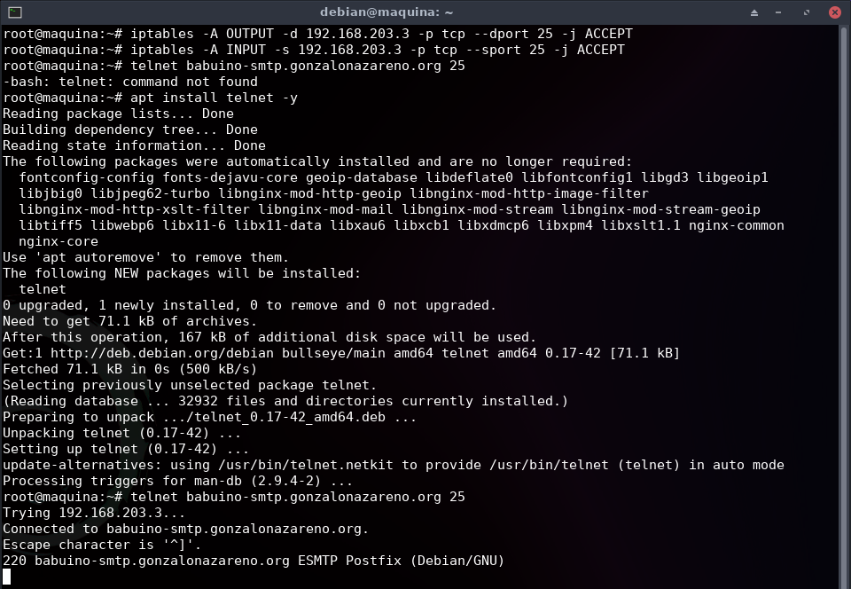

# **Práctica Informática Forense - SAD**

**Tabla de contenidos:**

- [**Práctica Informática Forense - SAD**](#práctica-informática-forense---sad)
  - [**Realización**](#realización)
    - [**Creación del escenario en OpenStack**](#creación-del-escenario-en-openstack)
    - [**Limpieza de las reglas previas**](#limpieza-de-las-reglas-previas)
    - [**Permitir SSH**](#permitir-ssh)
    - [**Política por defecto**](#política-por-defecto)
    - [**Permitimos tráfico para la interfaz loopback**](#permitimos-tráfico-para-la-interfaz-loopback)
    - [**Peticiones y respuestas protocolo ICMP**](#peticiones-y-respuestas-protocolo-icmp)
    - [**Consultas y respuestas DNS**](#consultas-y-respuestas-dns)
    - [**Tráfico http**](#tráfico-http)
    - [**Tráfico https**](#tráfico-https)
  - [**Tráfico http/https**](#tráfico-httphttps)
  - [**Permitimos el acceso a nuestro servidor web**](#permitimos-el-acceso-a-nuestro-servidor-web)
  - [**Configuración de un solo paso**](#configuración-de-un-solo-paso)
  - [**Ejercicios**](#ejercicios)
    - [**Ejercicio 1**](#ejercicio-1)
    - [**Ejercicio 2**](#ejercicio-2)
    - [**Ejercicio 3**](#ejercicio-3)
    - [**Ejercicio 4**](#ejercicio-4)
    - [**Ejercicio 5**](#ejercicio-5)
    - [**Ejercicio 6**](#ejercicio-6)

---

## **Realización**

### **Creación del escenario en OpenStack**

Para la creación del escenario usaré la opción de orquestación de *Stacks*, subiendo el [fichero de plantilla](escenario1.yaml) y configurando las opciones siguientes:


La IP de mi nueva máquina es: *172.22.200.96*

Compruebo que puedo conectarme a la máquina:

```bash
ssh debian@172.22.200.96 # Firewall1
```


### **Limpieza de las reglas previas**

Comandos a ejecutar:

```bash
sudo su -

iptables -F

iptables -t nat -F

iptables -Z

iptables -t nat -Z
```

### **Permitir SSH**

Cómo estamos conectado a la máquina por *ssh*, vamos a permitir la conexión *ssh* desde las redes *172.22.0.0/16* (la del instituto) y *172.29.0.0/16* (la de VPN), antes de cambiar las políticas por defecto a *DROP*, para no perder la conexión:

```bash
iptables -A INPUT -s 172.22.0.0/16 -p tcp --dport 22 -m state --state NEW,ESTABLISHED -j ACCEPT

iptables -A OUTPUT -d 172.22.0.0/16 -p tcp --sport 22 -m state --state ESTABLISHED -j ACCEPT

iptables -A INPUT -s 172.29.0.0/16 -p tcp --dport 22 -m state --state NEW,ESTABLISHED -j ACCEPT

iptables -A OUTPUT -d 172.29.0.0/16 -p tcp --sport 22 -m state --state ESTABLISHED -j ACCEPT
```

### **Política por defecto**

```bash
iptables -P INPUT DROP

iptables -P OUTPUT DROP
```

Comprobamos que ahora no puedo hacer por ejemplo ping:

```bash
ping 127.0.0.1 -c 3 # Localhost

ping 10.0.0.1 -c 3 # Puerta de enlace

ping kernel.org -c 3
```


### **Permitimos tráfico para la interfaz loopback**

```bash
iptables -A INPUT -i lo -p icmp -j ACCEPT

iptables -A OUTPUT -o lo -p icmp -j ACCEPT
```

Comprobamos que ahora puedo hacer ping a localhost:

```bash
ping 127.0.0.1 -c 3
```



### **Peticiones y respuestas protocolo ICMP**

Compruebo que aún no puedo hacer ping a una IP de internet:

```bash
ping 8.8.8.8 -c 3
```


```bash
iptables -A INPUT -i ens3 -p icmp --icmp-type echo-reply -j ACCEPT

iptables -A OUTPUT -o ens3 -p icmp --icmp-type echo-request -j ACCEPT
```

Comprobamos que ahora sí puedo hacer ping a una IP de internet:

```bash
ping 8.8.8.8 -c 3
```


### **Consultas y respuestas DNS**

```bash
iptables -A OUTPUT -o ens3 -p udp --dport 53 -m state --state NEW,ESTABLISHED -j ACCEPT

iptables -A INPUT -i ens3 -p udp --sport 53 -m state --state ESTABLISHED -j ACCEPT
```

Comprobamos que ahora sí puedo hacer ping a un dominio:

```bash
ping kernel.org -c 3
```


Si hacemos una consulta DNS desde la máquina vemos que funciona perfectamente:

```bash
dig @1.1.1.1 python.juanje.net
```


### **Tráfico http**

```bash
iptables -A OUTPUT -o ens3 -p tcp --dport 80 -m state --state NEW,ESTABLISHED -j ACCEPT

iptables -A INPUT -i ens3 -p tcp --sport 80 -m state --state ESTABLISHED -j ACCEPT
```

Compruebo que funciona el tráfico http:

```bash
curl portquiz.net:80
```


### **Tráfico https**

```bash
iptables -A OUTPUT -o ens3 -p tcp --dport 443 -m state --state NEW,ESTABLISHED -j ACCEPT

iptables -A INPUT -i ens3 -p tcp --sport 443 -m state --state ESTABLISHED -j ACCEPT
```

Compruebo que funciona el tráfico https:

```bash
curl portquiz.net:443
```


## **Tráfico http/https**

Podemos hacer un par de reglas que permitan el tráfico http/https (los dos puntos anteriores) usando la extensión *multiport*:

```bash
iptables -A OUTPUT -o ens3 -p tcp -m multiport --dports 80,443 -m state --state NEW,ESTABLISHED -j ACCEPT

iptables -A INPUT -i ens3 -p tcp -m multiport --sports 80,443 -m state --state ESTABLISHED -j ACCEPT
```

Para comprobar que funciona, primero elimino las reglas http y https anteriores:

```bash
iptables -D OUTPUT -o ens3 -p tcp --dport 80 -m state --state NEW,ESTABLISHED -j ACCEPT

iptables -D INPUT -i ens3 -p tcp --sport 80 -m state --state ESTABLISHED -j ACCEPT

iptables -D OUTPUT -o ens3 -p tcp --dport 443 -m state --state NEW,ESTABLISHED -j ACCEPT

iptables -D INPUT -i ens3 -p tcp --sport 443 -m state --state ESTABLISHED -j ACCEPT
```

Luego ejecuto las nuevas y compruebo que funcionan:

```bash
curl portquiz.net:80

curl portquiz.net:443
```



## **Permitimos el acceso a nuestro servidor web**

```bash
iptables -A INPUT -i ens3 -p tcp --dport 80 -m state --state NEW,ESTABLISHED -j ACCEPT

iptables -A OUTPUT -o ens3 -p tcp --sport 80 -m state --state ESTABLISHED -j ACCEPT
```

Para comprobar que funciona accedo a ella desde mi host (la imagen de OpenStack usada ya trae *apache2* preinstalado):


## **Configuración de un solo paso**

Para ahorrarnos ejecutar una por una las reglas como hasta ahora podemos crear un fichero que más tarde cargaremos con el comando *iptables-restore*:

```bash
nano reglas-iptables
```

Y escribimos las reglas que queremos que se ejecuten:

```bash
iptables -F

iptables -t nat -F

iptables -Z

iptables -t nat -Z

iptables -A INPUT -s 172.22.0.0/16 -p tcp --dport 22 -m state --state NEW,ESTABLISHED -j ACCEPT

iptables -A OUTPUT -d 172.22.0.0/16 -p tcp --sport 22 -m state --state ESTABLISHED -j ACCEPT

iptables -A INPUT -s 172.29.0.0/16 -p tcp --dport 22 -m state --state NEW,ESTABLISHED -j ACCEPT

iptables -A OUTPUT -d 172.29.0.0/16 -p tcp --sport 22 -m state --state ESTABLISHED -j ACCEPT

iptables -P INPUT DROP

iptables -P OUTPUT DROP

iptables -A INPUT -i lo -p icmp -j ACCEPT

iptables -A OUTPUT -o lo -p icmp -j ACCEPT

iptables -A INPUT -i ens3 -p icmp --icmp-type echo-reply -j ACCEPT

iptables -A OUTPUT -o ens3 -p icmp --icmp-type echo-request -j ACCEPT

iptables -A OUTPUT -o ens3 -p udp --dport 53 -m state --state NEW,ESTABLISHED -j ACCEPT

iptables -A INPUT -i ens3 -p udp --sport 53 -m state --state ESTABLISHED -j ACCEPT

iptables -A OUTPUT -o ens3 -p tcp -m multiport --dports 80,443 -m state --state NEW,ESTABLISHED -j ACCEPT

iptables -A INPUT -i ens3 -p tcp -m multiport --sports 80,443 -m state --state ESTABLISHED -j ACCEPT

iptables -A INPUT -i ens3 -p tcp --dport 80 -m state --state NEW,ESTABLISHED -j ACCEPT

iptables -A OUTPUT -o ens3 -p tcp --sport 80 -m state --state ESTABLISHED -j ACCEPT
```

Alternativamente podemos usar el comando *iptables-save* para guardar las reglas actuales en un fichero:

```bash
iptables-save > reglas-iptables
```

E independientemente de como las guardemos, podemos cargarlas con el comando *iptables-restore*:

```bash
iptables-restore < reglas-iptables
```

## **Ejercicios**

### **Ejercicio 1**

> **1. Permite poder hacer conexiones ssh al exterior.**

```bash
iptables -A OUTPUT -p tcp --dport 22 -m state --state NEW,ESTABLISHED -j ACCEPT

iptables -A INPUT -p tcp --sport 22 -m state --state ESTABLISHED -j ACCEPT
```

Comprobación conectándome por ssh a mi propia máquina:

```bash
ssh jjas-asir2@172.22.2.4
```


### **Ejercicio 2**

> **2. Deniega el acceso a tu servidor web desde una IP concreta.**

Primero localizo la ubicación de la regla que introduje anteriormente para permitir el acceso a mi servidor web:

```bash
iptables -L -n -v --line-numbers
```


Sabiendo que la regla está en la línea 7, tengo que agregar la nueva en esa línea para que *empuje* hacia abajo las demás reglas y esta se aplique antes:

```bash
iptables -I INPUT 7 -s 172.22.201.138 -p tcp --dport 80 -m state --state NEW,ESTABLISHED -j DROP
```


En este caso he bloqueado la IP flotante de mi máquina *Alfa* de OpenStack, si ahora intento acceder a mi servidor web desde ella:



Se bloquea correctamente el acceso ya que *curl* da *timeout* desde *Alfa*, en cambio, desde mi host funciona inmediatamente.

### **Ejercicio 3**

> **3. Permite hacer consultas DNS sólo al servidor *192.168.202.2*. Comprueba que no puedes hacer un *dig @1.1.1.1*.**

En este caso debo eliminar las reglas que permiten hacer peticiones DNS:

```bash
iptables -D OUTPUT -o ens3 -p udp --dport 53 -m state --state NEW,ESTABLISHED -j ACCEPT

iptables -D INPUT -i ens3 -p udp --sport 53 -m state --state ESTABLISHED -j ACCEPT
```

Y añadir la nueva regla que permita hacer peticiones DNS sólo al servidor indicado:

```bash
iptables -A OUTPUT -d 192.168.202.2 -p udp --dport 53 -m state --state NEW,ESTABLISHED -j ACCEPT

iptables -A INPUT -s 192.168.202.2 -p udp --sport 53 -m state --state ESTABLISHED -j ACCEPT
```

Comprobación:

```bash
dig @1.1.1.1 python.juanje.net

dig @192.168.202.2 python.juanje.net
```


### **Ejercicio 4**

> **4. No permitir el acceso al servidor web de *www.josedomingo.org* (Tienes que utilizar la IP). ¿Puedes acceder a *fp.josedomingo.org*?**

Primero obtengo la IP de *www.josedomingo.org*:

```bash
dig www.josedomingo.org +short
```

La IP del servidor web de *www.josedomingo.org* es *37.187.119.60*, ahora debo mirar la posición de la regla que agregué anteriormente para permitir el acceso a los protocolos HTTP y HTTPS:

```bash
iptables -L -n -v --line-numbers
```


Sabiendo que la posición es la 5, procedo a crear en esa posición la regla que bloquea el acceso a la IP *37.187.119.60*

```bash
iptables -I OUTPUT 5 -d 37.187.119.60 -p tcp --dport 80 -m state --state NEW,ESTABLISHED -j DROP
```

Si ahora intento acceder a *www.josedomingo.org* veré que no funciona. Tampoco podré acceder a *fp.josedomingo.org* ya que esta web está alojada en el mismo servidor que *www.josedomingo.org* por lo que comparten IP:

```bash
curl www.josedomingo.org

curl fp.josedomingo.org

dig www.josedomingo.org +short

dig fp.josedomingo.org +short
```


### **Ejercicio 5**

> **5. Permite mandar un correo usando nuestro servidor de correo: *babuino-smtp*. Para probarlo ejecuta un *telnet babuino-smtp.gonzalonazareno.org 25*.**

La IP de *babuino-smtp* es *192.168.203.3*.

Creo las reglas que permiten el acceso al puerto 25 del servidor *babuino-smtp*:

```bash
iptables -A OUTPUT -d 192.168.203.3 -p tcp --dport 25 -j ACCEPT

iptables -A INPUT -s 192.168.203.3 -p tcp --sport 25 -j ACCEPT
```

Pruebo con *telnet* la conexión (he tenido que instalarlo):

```bash
telnet babuino-smtp.gonzalonazareno.org 25
```



### **Ejercicio 6**

> **6. Instala un servidor mariadb, y permite los accesos desde la IP de tu cliente. Comprueba que desde otro cliente no se puede acceder.**

Instalo *mariadb*:

```bash
apt install mariadb-server -y
```

Edito el fichero */etc/mysql/mariadb.conf.d/50-server.cnf* para permitir las conexiones desde cualquier IP:

```bash
nano /etc/mysql/mariadb.conf.d/50-server.cnf
```

```cnf
bind-address = 0.0.0.0
```

Reinicio el servicio:

```bash
systemctl restart mariadb
```

Permito solo las conexiones desde la IP de mi host:

```bash
iptables -A INPUT -s 172.22.2.4 -p tcp --dport 3306 -j ACCEPT

iptables -A OUTPUT -d 172.22.2.4 -p tcp --sport 3306 -j ACCEPT
```

Compruebo que funciona usando la utilidad *nc* desde mi host pero no desde *Alfa*:

```bash
nc -zvw10 172.22.200.96 3306
```


---

✒️ **Documentación realizada por Juan Jesús Alejo Sillero.**
